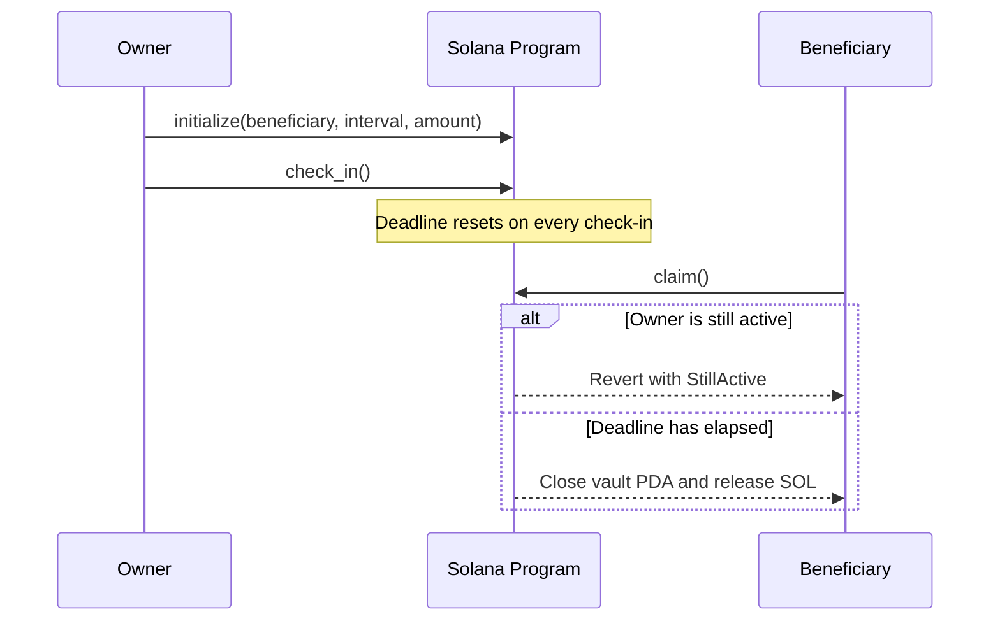

# Solana Dead Man's Switch

A trustless inheritance vault built on Solana. An owner deposits SOL, names a
beneficiary, and chooses a check-in interval. If the owner stops checking in,
the beneficiary can claim the vault after the deadline.

The core program is intentionally simple: no custodian, no keeper service, and
no privileged server decides when funds move. The beneficiary's `claim`
transaction checks the deadline on-chain.

> Built for the Solana track of a hackathon. The current deployment is a devnet
> prototype and has not been audited. Do not use it to custody real funds.

## Live Status

- Anchor program deployed on Solana devnet
- Full owner flow wired in the browser: initialize, check in, deposit, update,
  and cancel
- Beneficiary lookup and claim flow wired against live on-chain state
- Optional email and Telegram reminder service implemented with Supabase Edge
  Functions
- Anchor tests and a live devnet lifecycle smoke test included

**Devnet program:** [`6gbTnghr3AXPbCTjieq3veCmt656ALbEd7VUGX9z5fFu`](https://explorer.solana.com/address/6gbTnghr3AXPbCTjieq3veCmt656ALbEd7VUGX9z5fFu?cluster=devnet)

## How It Works



Each owner has one vault PDA derived from `["switch", owner_pubkey]`. The
program stores the owner, beneficiary, last check-in timestamp, interval, and
deposited amount.

| Instruction | Who can call it | Effect |
| --- | --- | --- |
| `initialize` | Owner | Creates the vault PDA and deposits SOL |
| `check_in` | Owner | Resets the liveness timestamp |
| `deposit` | Owner | Adds SOL to an active vault |
| `update_config` | Owner | Changes the beneficiary or interval |
| `claim` | Beneficiary | Releases SOL after the deadline |
| `cancel` | Owner | Closes the vault and returns SOL |

## Optional Reminders

The on-chain vault does not depend on an off-chain service. The optional
Supabase integration sends reminders before a deadline so the owner has time to
check in.

- `subscribe` registers or updates an owner's notification preferences after
  verifying the vault on-chain.
- `reminder-tick` checks active subscriptions and sends email or Telegram
  notifications inside the configured warning window.

If the reminder service is unavailable, the program still behaves exactly the
same way. Contact details remain off-chain. See
[`supabase/SETUP.md`](supabase/SETUP.md) for deployment details.

## Repository Layout

```text
.
├── programs/deadman-switch/   # Anchor program
├── tests/                     # Local Anchor integration tests
├── scripts/                   # Devnet smoke test and demo seeding script
├── app/                       # Vite + React frontend
├── supabase/                  # Optional reminder service
├── target/idl/                # Committed IDL consumed by the frontend
└── DEMO.md                    # Short live-demo walkthrough
```

## Run Locally

### Prerequisites

- Rust and Cargo
- Solana CLI configured for devnet
- Anchor CLI
- Node.js and npm
- A funded devnet wallet at `~/.config/solana/id.json`

### Program

```bash
npm install
solana config set --url devnet
anchor build
anchor test
```

### Frontend

```bash
cd app
npm install
npm run dev
```

Open [`http://localhost:5173`](http://localhost:5173), connect Phantom or
Solflare on devnet, and follow the owner or beneficiary flow.

### Live Devnet Smoke Test

The smoke test creates a vault, proves that an early claim fails, waits for the
deadline, claims the vault, and verifies that the PDA closes.

```bash
ANCHOR_PROVIDER_URL=https://api.devnet.solana.com \
ANCHOR_WALLET=$HOME/.config/solana/id.json \
npx ts-mocha -p ./tsconfig.json -t 1000000 scripts/smoke-devnet.ts
```

## Demo Mode

For a fast live walkthrough, use `/arm?fast=1`. It exposes second-based
intervals so the full create-to-claim lifecycle can run during a short demo.

The UI also supports `?demo=1` on `/cockpit` and `/watch` for rehearsal-only
state previews. These previews do not replace the real devnet transaction flow.
See [`DEMO.md`](DEMO.md) for the full walkthrough.

## Security Notes

- Deadline enforcement happens in the Solana program, not in the reminder
  service or frontend.
- Only the configured owner can check in, deposit, update, or cancel.
- Only the configured beneficiary can claim.
- Claims before `last_checkin + interval` fail with `StillActive`.
- The devnet program is upgradeable and controlled by the deployment wallet.
- This prototype has not received a security audit.

## Current Limitations

- SOL deposits only; SPL token support is not implemented.
- One active vault per owner wallet.
- Beneficiary discovery currently requires the owner's address.
- The activity feed is session-local rather than a persistent event index.
- The frontend is configured for devnet.

## Documentation

- [`app/README.md`](app/README.md): frontend architecture and routes
- [`supabase/SETUP.md`](supabase/SETUP.md): optional reminders deployment
- [`DEMO.md`](DEMO.md): live demo walkthrough
- [`DEMO_QA.md`](DEMO_QA.md): project Q&A

## License

ISC
